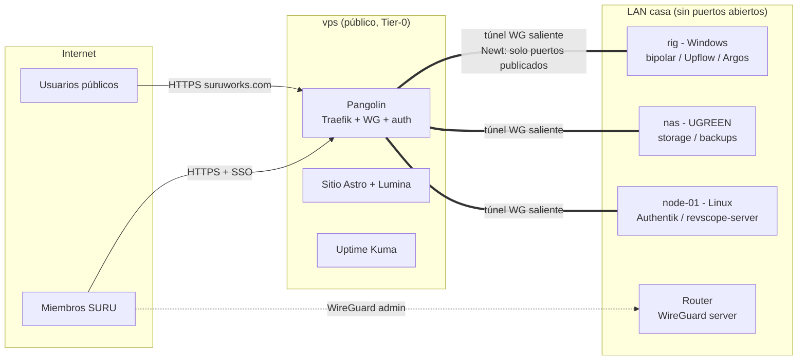

# Topología de hosting multi-PC — SURU homelab

> Decisión de arquitectura de infraestructura física/red para hostear los servicios del grupo bajo `suruworks.com`. Complementa [platform-integration.md](platform-integration.md) (qué apps se hostean) y [../auth/group-sso.md](../auth/group-sso.md) (identidad). Investigación de respaldo: last30days 2026-08-20 (`homelab-sso-multi-node-self-hosting-stack-raw-v3.md` en la librería de research). Revisado con pase adversario de seguridad/exactitud/consistencia/completitud el mismo día.

**Estado:** Decidido 2026-08-20. Fase 0 en curso.

---

## 1. Principios

1. **Cero port-forwarding en casa.** Ningún puerto del router residencial abierto a internet. Todo el tráfico público entra por un VPS; los nodos de casa se conectan al VPS con túneles WireGuard salientes.
2. **Dos planos de red separados, y se mantienen separados:**
   - **Plano público** — lo que el mundo ve (`suruworks.com` y subdominios). Entra por el VPS.
   - **Plano de administración** — UIs de admin, NAS, Komodo, llama-server. Solo por VPN o LAN. **Nunca** se publica en Pangolin, ni "temporalmente" sin TTL (ver §3).
3. **Docker Compose por nodo, no Kubernetes.** Consenso 2026 del homelab (y regla ya escrita en [tech-stack-2025](../stack/tech-stack-2025.md)): no arrancar k3s hasta que Compose no dé rolling deploys. Con 1-3 nodos y un operador, k3s es sobrecosto puro.
4. **Identidad centralizada, servicios sin user-DB propia.** Toda app nueva valida OIDC contra un issuer configurable (patrón ya implementado en revscope-server). Ver [group-sso.md](../auth/group-sso.md).
5. **El hardware que ya existe primero.** El rig de IA (Windows) no se fuerza a Docker: sus servicios GPU corren nativos y se publican vía túnel. Los servicios 24/7 livianos van a Linux (node-01/NAS). El IdP jamás corre en el rig ni en Windows.
6. **Backend detrás de gate = backend inalcanzable sin el gate.** Un servicio protegido por forward-auth en el edge debe ser inalcanzable por otra vía: bind a localhost/interfaz del túnel o firewall de host que solo acepte el ingress del túnel. El edge elimina (strip) cualquier `X-Forwarded-User`/`Remote-User` entrante. Sin esto, el SSO es decorativo — cualquier dispositivo en LAN/VPN saltaría el gate.

---

## 2. Nodos

| Nodo | Hardware / OS | Rol | Servicios |
|---|---|---|---|
| `vps` | VPS pequeño. Opciones: Hetzner **CPX11 en Ashburn** (~US$5-6/mes, la línea CX es solo-EU) o CX22 en EU (~€4, +~100ms desde Colombia); alternativas US baratas: Netcup, OVH, RackNerd | Punta pública, túneles, vigía externo. **Activo Tier-0**: hardening máximo (ver §7) | Pangolin (Traefik + WireGuard + auth), sitio estático Astro, lumina-calendar (estático), Uptime Kuma |
| `rig` | Ryzen 9 7900X3D, 128GB, RX 7800 XT 16GB (+ R9700 32GB pendiente), Windows 11 | Nodo GPU. Servicios nativos Windows, no dockerizados. Antes de publicarlo aplica el gate de aislamiento (ver [roadmap del rig](https://github.com/santiquiroz/local-llm-homelab/blob/master/docs/homelab-roadmap.md)) | bipolar-code + llama-server, Upflow, Argos (demo), Ollama |
| `node-01` | Cualquier PC/mini-PC con Linux (uno viejo existente, o mini-PC N100 ~US$150). **Requerido para F2** — deja de ser crítico cuando el NAS absorba sus servicios en F3 | Servicios 24/7 que no deben depender del rig; host interino de identidad | Authentik, revscope-server + PostgreSQL/PostGIS, Komodo Core (interino) |
| `nas` (futuro) | UGREEN DXP (4 bahías clase DXP4800 Plus), UGOS Pro | Almacenamiento, backups, contenedores livianos 24/7 | SMB/NFS, repositorio restic, Authentik, Komodo Core, monitoreo interno |
| Móviles | S25 Ultra, etc. | Clientes VPN; Nodo (LLM on-device) como historia de ecosistema, no como servicio hosteado | — |

Regla de colocación: **GPU → rig; 24/7 liviano → node-01/NAS; público estático → vps.** El rig puede apagarse o reiniciarse sin tumbar identidad, sitio ni monitoreo. **Identidad (Authentik) solo corre en node-01 → NAS, nunca en el rig** (Authentik es contenedores Linux; el rig es Windows nativo y por diseño apagable).

---

## 3. Planos de red

### Plano público — VPS + Pangolin

- **Pangolin** (fosrl/pangolin, 22k+ estrellas, YC S25) combina reverse proxy Traefik, túneles WireGuard y control de acceso identity-aware en un solo stack Compose sobre el VPS. Cada nodo de casa corre el agente **Newt** (binario Go, hay build Windows para el rig) que abre el túnel saliente — el router de casa no abre nada.
- **Cada túnel Newt expone exactamente los puertos de servicio publicados, nunca SSH/RDP/UIs de admin.** El túnel no rutea la LAN: es proxy por recurso declarado.
- Licenciamiento (verificado 2026-08): core AGPL-3 (CE) incluye OIDC básico contra IdP externo; auto-provisioning y sync de roles desde el IdP caen en la Fossorial Commercial License — **gratis para uso personal y negocios <US$100K/año, aplicable a SURU hoy**.
- DNS: `suruworks.com` → IP del VPS (Cloudflare DNS, modo DNS-only; TLS lo termina Traefik con Let's Encrypt). Concretar en F0: migración de nameservers, tabla de registros alineada al [mapa de subdominios](platform-integration.md), wildcard `*.suruworks.com` + DNS-01 (token Cloudflare scoped a TXT de la zona) vs por-subdominio + HTTP-01.
- **La cuenta DNS/registrar es parte de la cadena de confianza** (un takeover re-apunta `auth.` y phishea a todos): 2FA con llave de hardware, registrar lock, DNSSEC, registro CAA fijando Let's Encrypt. Va en F0.
- Por recurso, Pangolin permite: público sin auth, PIN/password, o SSO OIDC contra el IdP del grupo.
- **Publicación de emergencia de algo del plano admin:** solo tras SSO + `suru-admins`, registrada como cambio en `suru-infra` (config declarativa — un diff delata rutas olvidadas), y con verificación programada: cron en el VPS que compara los recursos activos de Pangolin contra el mapa de subdominios aprobado y alerta ante cualquier recurso público inesperado.

### Plano de administración — VPN del router

- WireGuard server en el router de casa. **Perfiles por miembro/dispositivo con `AllowedIPs` acotados a los hosts/puertos que ese miembro necesita — no toda la LAN para todos.** Solo `suru-admins` reciben perfiles con alcance amplio.
- **Detección CGNAT (F0):** comparar la IP WAN que reporta el router contra la IP pública vista desde fuera (`curl ifconfig.me` desde un nodo). Si difieren → CGNAT → activar plan B.
- **Plan B (CGNAT) — es un cambio de arquitectura, no un atajo.** Los túneles Newt no sirven para esto (solo exponen recursos declarados). Mecanismo real: instancia WireGuard **separada** en el VPS (namespace/puerto propio, jamás la misma superficie que Pangolin) con un nodo de casa actuando de subnet-router hacia la LAN, y `AllowedIPs` por peer acotados igual que en el plan A. Alternativa a evaluar: los clients nativos de Pangolin (Olm). **Probar el plan B en F1 aunque no haya CGNAT** — una contingencia no ensayada no existe. Plan C: Tailscale (gratis ≤3 usuarios).
- Nada del plano admin se publica en Pangolin como subdominio permanente. Komodo, UIs del NAS, llama-server: solo VPN/LAN.

---

## 4. Orquestación multi-PC

**Decisión: Docker Compose por nodo + Komodo como plano de control. k3s y Swarm rechazados.**

- **Komodo** (GPL-3.0, gratis sin caps): dashboard único que maneja stacks Compose en N servidores vía agentes Periphery, con deploys git-driven, RBAC y login OIDC (se integra al SSO del grupo). Alternativas descartadas: Portainer (RBAC y team-sync de OAuth en tier Business; el login OAuth básico sí está en CE) y Dockge (tiene agentes multi-host desde 1.4, pero sin RBAC, sin OIDC y sin deploys git-driven).
- Komodo Core corre en node-01 → NAS; Periphery en cada nodo Linux. El rig Windows queda fuera de Komodo (servicios nativos). **Komodo es plano admin: acceso solo por VPN/LAN — nunca subdominio público** (es RCE-de-flota con una sesión admin robada).
- **GitOps:** los archivos Compose y config de cada nodo viven en un repo privado nuevo `suru-infra` (crear en F1; NO en este repo, que es público). Komodo sincroniza desde ahí. Secretos fuera de git siempre — con escrow (§6).
- Umbral de reevaluación: >3 nodos Linux y necesidad real de rolling deploys/HA → reabrir k3s. No antes.

---

## 5. NAS UGREEN (compra futura)

Rol: **almacenamiento + backups + los contenedores que nunca deben apagarse.** No es servidor de aplicaciones pesadas.

1. Clase DXP4800 Plus (4 bahías, x86, 8GB+ ampliable); arrancar con 2 discos NAS (mirror) + expansión futura.
2. Quedarse en **UGOS Pro** (en 2026 soporta Docker completo). TrueNAS como escape documentado si UGOS estorba, aceptando pérdida de soporte.
3. Hardening día 1: admin propio, deshabilitar UPnP, deshabilitar el acceso cloud/relay de UGREEN (el acceso remoto es por nuestra VPN, nunca por la nube del fabricante), SSH con llaves, firmware al día.
4. Migran al NAS: Authentik, Komodo Core, monitoreo interno (Beszel/Netdata), repositorio restic.
5. NFS/SMB solo a LAN/VPN.

## 6. Backups y custodia de secretos — 3-2-1

| Qué | Primario | Secundario | Externo |
|---|---|---|---|
| **DB de Authentik** (identidad del grupo) | Disco node-01/NAS | restic → NAS (desde F3) | **restic → B2 desde el día 1 de F2** (cuesta centavos; no espera al NAS) |
| Volúmenes Docker restantes (PostGIS de revscope, Komodo) | Disco local del nodo | restic → NAS (nightly, F3+) | restic → B2 (semanal) |
| **`C:\litellm` del rig** (providers.json + `.env` con tokens reales de proveedores) | Disco del rig | restic **cifrado** → NAS | B2 |
| Modelos GGUF / datasets del rig | Disco del rig | NAS (rsync manual; re-descargables) | no aplica |
| Repos de código | GitHub | — | — |
| Config VPS (compose de Pangolin) | repo `suru-infra` | NAS | B2 |

**Custodia de secretos (escrow) — sin esto los backups no restauran:**

- `AUTHENTIK_SECRET_KEY`, password del repo restic y secretos de Komodo se guardan **fuera de los nodos, en dos lugares independientes**: gestor de contraseñas del operador + copia sellada (impresa o vault de un segundo miembro de confianza). Perder el nodo + su `.env` no puede significar perder la capacidad de restaurar.
- El material `.env` de cada nodo entra a un backup cifrado propio con custodia de su llave.
- **El simulacro de restore (semestral) parte de "el disco del nodo no existe"**, no de un nodo vivo: restaurar Authentik y PostGIS desde B2 usando solo los secretos del escrow.

## 7. Monitoreo y seguridad operativa

- Uptime Kuma en el VPS. **Solo la status page dedicada se publica en `status.suruworks.com`; el dashboard completo (incluye la API socket.io) jamás se publica — VPN o forward-auth en hostname propio, nunca split por path.** Auditar qué hostnames internos revela la status page.
- **VPS = Tier-0** (termina TLS de todo, corre forward-auth, tiene túneles a todos los nodos): SSH solo llaves + 2FA/llave hardware para el proveedor, CrowdSec o fail2ban, auditd/alertas sobre cambios de config, alerta ante recursos nuevos de Pangolin (§3), actualizaciones de seguridad automáticas.
- Watchtower NO en servicios con estado (Authentik/Postgres: upgrade manual con backup previo); sí en estáticos.
- Logs: `docker logs` + Uptime Kuma; Loki cuando duela (misma filosofía de fases de [tech-stack-2025](../stack/tech-stack-2025.md)).

## 8. Costos estimados

| Ítem | Costo | Cuándo |
|---|---|---|
| Dominio suruworks.com | ya existe (~US$12/año renovación) | ahora |
| VPS (Hetzner CPX11 Ashburn o CX22 EU) | ~US$5-6/mes | F1 |
| `node-01` | US$0 si hay PC viejo utilizable; mini-PC N100 ~US$150 si no | F2 |
| SMTP transaccional (invitaciones/recovery de Authentik) | US$0-1/mes a este volumen | F2 |
| Backblaze B2 (~100GB) | ~US$0.6/mes | **F2** (adelantado; no espera al NAS) |
| UGREEN DXP4800 Plus + 2×HDD NAS 8TB | ~US$700 + ~US$320 (una vez) | F3 |
| Pangolin, Authentik, Komodo, restic | US$0 (open source) | — |

## 9. Fases (con criterios de salida)

- **F0 — ahora ($0):** docs publicados; DNS: nameservers en Cloudflare (o DNS-only en registrar actual) + hardening de la cuenta (2FA hardware, registrar lock, DNSSEC, CAA); WireGuard del router probado; detección CGNAT ejecutada.
  *Salida:* `dig suruworks.com` resuelve donde se decidió; un miembro entra por VPN desde red externa **o** la contingencia CGNAT quedó activada y documentada.
- **F1 — VPS:** Pangolin desplegado; sitio Astro + Lumina en vivo; Uptime Kuma; túnel Newt de prueba desde el rig; repo `suru-infra` creado; **ensayo del plan B CGNAT** (§3).
  *Salida:* recurso de prueba del rig accesible vía `https://…suruworks.com` con TLS válido; status page pública; plan B probado una vez.
- **F2 — identidad:** node-01 aprovisionado (precondición); Authentik en `auth.suruworks.com`; SMTP configurado (SPF/DKIM/DMARC en DNS); **restic→B2 de la DB de Authentik desde el día 1**; revscope-server con `AUTH_MODE=oidc` — primera app del grupo con SSO real; cadena forward-auth validada con un servicio trivial y config de referencia guardada en `suru-infra`.
  *Salida:* un miembro invitado entra con passkey a revscope; restore de prueba de la DB de Authentik desde B2 ejecutado una vez.
- **F3 — NAS:** compra UGREEN (trigger: F2 estable + presupuesto ~US$1.000 disponible); migran Authentik/Komodo/monitoreo; 3-2-1 completo operando.
  *Salida:* simulacro de restore "disco muerto" desde escrow + B2 superado.
- **F4 — servicios GPU para miembros:** Upflow, bipolar-code y Argos (demo, footage sintético) publicados solo-miembros tras forward-auth; **precondición: gate de aislamiento del rig** (cuentas de servicio de baja privilegio, credenciales fuera del alcance, Newt como servicio — ver roadmap del rig); Komodo gestionando los nodos Linux.
  *Salida:* miembro no-admin usa Upflow vía web; `/api/*` de bipolar inalcanzable desde internet (test negativo documentado).
- **F5 — plataforma SURUworks:** cuando arranque el desarrollo real de la plataforma comercial, aplica el stack ya especificado ([microservices-architecture](microservices-architecture.md), [auth-system-spec](../auth/auth-system-spec.md)); esta topología la hostea sin cambios.

## 10. Riesgos

| Riesgo | Mitigación |
|---|---|
| CGNAT del ISP rompe la VPN del router | Plan B ensayado en F1 (instancia WG separada en VPS + subnet-router, AllowedIPs acotados); Tailscale plan C |
| El rig es Windows y single-point para todo lo GPU | Aceptado: servicios GPU best-effort para miembros, nunca SLA público; identidad/sitio no dependen del rig; gate de aislamiento antes de F4 |
| Compromiso del VPS (Tier-0) | Túneles exponen solo puertos de servicio; planos separados (plan B en instancia WG aparte); hardening §7; los backends validan su propio auth donde aplica |
| ISP residencial prohíbe/limita hosting | Solo tráfico tunelizado saliente; lo público vive en el VPS |
| Takeover de la cuenta DNS/registrar | Hardening F0: 2FA hardware, registrar lock, DNSSEC, CAA |
| Features de IdP de Pangolin cambian de licencia | Ya verificado: CE cubre OIDC básico; la licencia comercial es gratis bajo US$100K/año; y la auth crítica vive en Authentik + validación en cada app |
| Un solo operador (bus factor) | Docs en este repo; `suru-infra` con README de restore; escrow de secretos en dos custodias (§6); break-glass con segunda copia sellada ([group-sso](../auth/group-sso.md)) |
