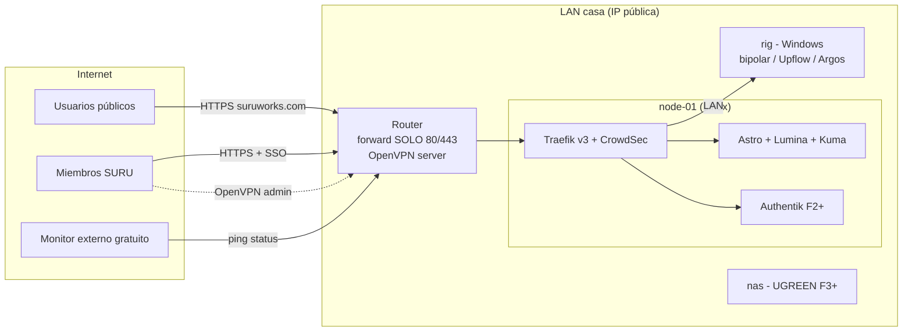

# Topología de hosting multi-PC — SURU homelab

> Decisión de arquitectura de infraestructura física/red para hostear los servicios del grupo bajo `suruworks.com`. Complementa [platform-integration.md](platform-integration.md) (qué apps se hostean) y [../auth/group-sso.md](../auth/group-sso.md) (identidad). Investigación de respaldo: last30days 2026-08-20 (`homelab-sso-multi-node-self-hosting-stack-raw-v3.md` en la librería de research). Revisado con pase adversario de seguridad/exactitud/consistencia/completitud el mismo día.

**Estado:** Decidido 2026-08-20. Actualizado el mismo día: **sin VPS ni túneles** — hay IP pública real, la entrada es port-forwarding directo al reverse proxy de casa, y el plano privado es la VPN OpenVPN del router. Fase 0 en curso.

---

## 1. Principios

1. **Superficie mínima en el router.** Solo se abren **80/443** hacia el host del reverse proxy (Traefik). Ningún otro puerto forwardeado, nunca. UPnP y WPS deshabilitados.
2. **Dos planos de red separados, y se mantienen separados:**
   - **Plano público** — lo que el mundo ve (`suruworks.com` y subdominios). Entra por 80/443 → Traefik en `node-01`.
   - **Plano de administración** — UIs de admin, NAS, Komodo, llama-server, dashboard de Traefik. Solo por **OpenVPN del router** o LAN. Nunca detrás del ingress público.
3. **Docker Compose por nodo, no Kubernetes.** Consenso 2026 del homelab (y regla ya escrita en [tech-stack-2025](../stack/tech-stack-2025.md)): no arrancar k3s hasta que Compose no dé rolling deploys. Con 1-3 nodos y un operador, k3s es sobrecosto puro.
4. **Identidad centralizada, servicios sin user-DB propia.** Toda app nueva valida OIDC contra un issuer configurable (patrón ya implementado en revscope-server). Ver [group-sso.md](../auth/group-sso.md).
5. **El hardware que ya existe primero.** El rig de IA (Windows) no se fuerza a Docker: sus servicios GPU corren nativos y Traefik los proxya por LAN. Los servicios 24/7 livianos van a Linux (node-01/NAS). El IdP jamás corre en el rig ni en Windows.
6. **Backend detrás de gate = backend inalcanzable sin el gate.** Un servicio protegido por forward-auth debe ser inalcanzable por otra vía: bind a la interfaz correcta o firewall de host que solo acepte al Traefik de node-01. El edge elimina (strip) cualquier `X-Forwarded-User`/`Remote-User` entrante. Sin esto, el SSO es decorativo — cualquier dispositivo en LAN/VPN saltaría el gate.
7. **Traefik es el mismo gateway ya locked del stack** ([tech-stack-2025](../stack/tech-stack-2025.md)): la plataforma comercial futura entra a la misma topología sin pieza nueva.

---

## 2. Nodos

| Nodo | Hardware / OS | Rol | Servicios |
|---|---|---|---|
| `node-01` | **Decidido 2026-08-20: la torre Ryzen 7 3700X, 16GB RAM, 1TB NVMe** (ex-banco de pruebas de OpenWinBlue). Debian + Docker; el banco de drivers se preserva en una **VM Windows 10 (KVM) con passthrough USB del dongle BT** — test-signing y BSODs encerrados en la VM, el ingress no se entera. Consumo ~50-70W 24/7 (mitigable con eco-mode del Ryzen). Deja de ser crítico cuando el NAS absorba sus servicios en F3 | **Ingress público** + servicios 24/7 que no deben depender del rig | **Traefik v3** (80/443, Let's Encrypt), sitio estático Astro, lumina-calendar, Uptime Kuma, CrowdSec; desde F2: Authentik, revscope-server + PostgreSQL/PostGIS, Komodo Core (interino) |
| `rig` | Ryzen 9 7900X3D, 128GB, RX 7800 XT 16GB (+ R9700 32GB pendiente), Windows 11 | Nodo GPU. Servicios nativos Windows, proxiados por Traefik vía LAN. Antes de publicarlo aplica el gate de aislamiento (ver [roadmap del rig](https://github.com/santiquiroz/local-llm-homelab/blob/master/docs/homelab-roadmap.md)) | bipolar-code + llama-server, Upflow, Argos (demo), Ollama |
| `nas` (futuro) | UGREEN DXP (4 bahías clase DXP4800 Plus), UGOS Pro | Almacenamiento, backups, contenedores livianos 24/7 | SMB/NFS, repositorio restic, Authentik, Komodo Core, monitoreo interno |
| Router | Router con IP pública, port-forwarding y **servidor OpenVPN** | Frontera: forward 80/443 → node-01; VPN del plano admin | OpenVPN server (perfiles por miembro/dispositivo) |
| Móviles | S25 Ultra, etc. | Clientes VPN; Nodo (LLM on-device) como historia de ecosistema, no como servicio hosteado | — |

Regla de colocación: **GPU → rig; 24/7 liviano e ingress → node-01/NAS.** El rig puede apagarse o reiniciarse sin tumbar identidad, sitio ni monitoreo. **Identidad (Authentik) solo corre en node-01 → NAS, nunca en el rig.**

---

## 3. Planos de red

### Plano público — port-forwarding 80/443 → Traefik

- El router forwardea **únicamente 80 y 443** a `node-01`. Ahí Traefik v3 termina TLS (Let's Encrypt) y rutea por hostname según el [mapa de subdominios](platform-integration.md).
- **DNS:** `suruworks.com` → IP pública de casa (Cloudflare DNS). En F0 confirmar si la IP es estática o dinámica; si es dinámica, contenedor DDNS (`cloudflare-ddns`) en node-01 actualizando el registro A. Certificados: wildcard `*.suruworks.com` con DNS-01 (token Cloudflare scoped a TXT de la zona) — evita exponer subdominios uno a uno en certificate transparency.
- **La cuenta DNS/registrar es parte de la cadena de confianza** (un takeover re-apunta `auth.` y phishea a todos): 2FA con llave de hardware, registrar lock, DNSSEC, registro CAA fijando Let's Encrypt. Va en F0.
- **Trade-off aceptado (y sus mitigaciones):** exponer la IP de casa revela ubicación aproximada y recibe el escaneo de fondo de internet. Mitigación: solo 2 puertos abiertos, CrowdSec en Traefik (bloqueo de IPs abusivas), rate-limiting middleware en endpoints de login/API, y **opción de escalada barata**: activar el proxy de Cloudflare (orange-cloud, gratis) delante para ocultar la IP si el ruido o un DDoS molestan — es un toggle en el DNS, no un rediseño. Se arranca DNS-only (TLS end-to-end propio) y se escala solo si hace falta.
- La config de Traefik (routers/middlewares) es **declarativa y vive en `suru-infra`**: un diff delata cualquier ruta pública no aprobada; cron simple en node-01 alerta si la config activa difiere del repo.
- **Publicación de emergencia de algo del plano admin:** solo tras SSO + `suru-admins`, registrada como cambio en `suru-infra`, y revertida con TTL — nunca una ruta permanente.

### Estado DNS real (relevado 2026-08-20)

- **IP pública de casa: `181.206.62.242` — estática (Claro).** DDNS innecesario.
- DNS gestionado hoy en el panel de **Claro Cloud** (`cp.cloud.claro.com.co`). El apex `suruworks.com` y `www` **ya apuntan a la IP de casa**.
- Registros preexistentes a respetar al migrar o editar:
  - **Correo activo del dominio**: MX ×4 → `mx*.carrierzone.com` + A de `ftp/pop/smtp/webmail` → `69.49.115.x` (hosting de correo de Claro/Hostopia). Copiar tal cual si se migran nameservers — romper esto rompe el email del dominio. Candidato natural a SMTP de Authentik en F2 (buzón `noreply@`), con Resend como alternativa.
  - `minecraft.`, `cloud.`, `hes.` → `186.83.193.208`: IP distinta a la de casa — inventariar qué son antes de tocar (¿servicios previos? ¿IP vieja? ¿otro miembro?). No se eliminan sin confirmar.
- **Plan:** migrar nameservers a **Cloudflare (free)** — el panel de Claro no tiene API (sin DNS-01 para wildcard, sin CAA, sin el toggle orange-cloud que es nuestra escalada anti-DDoS documentada). Cloudflare importa los registros automáticamente; verificar a mano que MX/correo y los tres subdominios legacy queden idénticos, y dejar `minecraft.` siempre DNS-only (el proxy de Cloudflare no proxya TCP no-HTTP). Mientras la migración no ocurra, F1 funciona igual sobre el DNS de Claro con registros A por subdominio → `181.206.62.242` y certificados HTTP-01 por hostname (el wildcard llega con Cloudflare).

### Plano de administración — OpenVPN del router

- Servidor **OpenVPN en el router** (capacidad ya disponible). Perfiles `.ovpn` **por miembro y por dispositivo**, entregados por canal seguro (QR presencial o vault compartido, nunca chat plano). Revocación de certificado por miembro al salir ([offboarding](../auth/group-sso.md)).
- Acceso acotado: donde el router lo permita, restringir por perfil a los hosts/puertos que ese miembro necesita; solo `suru-admins` con alcance amplio. Si el firmware no da granularidad, se compensa con firewall de host en node-01/NAS.
- Da acceso a: UIs de admin, NAS, Komodo, llama-server directo, dashboard de Traefik. Nada de esto se publica en el ingress.
- Nota: si el router también soporta WireGuard, es alternativa válida (más simple/rápida); OpenVPN es lo decidido por disponibilidad actual. Tailscale queda como plan B si administrar la VPN del router cansa.
- **Contingencia futura:** si el ISP algún día mueve la conexión a CGNAT, esta topología pierde la entrada — en ese momento se reabre la decisión (VPS de entrada o túneles). No se diseña hoy.

---

## 4. Orquestación multi-PC

**Decisión: Docker Compose por nodo + Komodo como plano de control. k3s y Swarm rechazados.**

- **Komodo** (GPL-3.0, gratis sin caps): dashboard único que maneja stacks Compose en N servidores vía agentes Periphery, con deploys git-driven, RBAC y login OIDC (se integra al SSO del grupo). Alternativas descartadas: Portainer (RBAC y team-sync de OAuth en tier Business; el login OAuth básico sí está en CE) y Dockge (tiene agentes multi-host desde 1.4, pero sin RBAC, sin OIDC y sin deploys git-driven).
- Komodo Core corre en node-01 → NAS; Periphery en cada nodo Linux. El rig Windows queda fuera de Komodo (servicios nativos). **Komodo es plano admin: acceso solo por VPN/LAN — nunca subdominio público** (es RCE-de-flota con una sesión admin robada).
- **GitOps:** los archivos Compose y config de cada nodo (incluido el Traefik de ingress) viven en un repo privado nuevo `suru-infra` (crear en F1; NO en este repo, que es público). Komodo sincroniza desde ahí. Secretos fuera de git siempre — con escrow (§6).
- Umbral de reevaluación: >3 nodos Linux y necesidad real de rolling deploys/HA → reabrir k3s. No antes.

## 5. NAS UGREEN (compra futura)

Rol: **almacenamiento + backups + los contenedores que nunca deben apagarse.** No es servidor de aplicaciones pesadas.

1. Clase DXP4800 Plus (4 bahías, x86, 8GB+ ampliable); arrancar con 2 discos NAS (mirror) + expansión futura.
2. Quedarse en **UGOS Pro** (en 2026 soporta Docker completo). TrueNAS como escape documentado si UGOS estorba, aceptando pérdida de soporte.
3. Hardening día 1: admin propio, deshabilitar UPnP, deshabilitar el acceso cloud/relay de UGREEN (el acceso remoto es por nuestra VPN, nunca por la nube del fabricante), SSH con llaves, firmware al día.
4. Migran al NAS: Authentik, Komodo Core, monitoreo interno (Beszel/Netdata), repositorio restic.
5. NFS/SMB solo a LAN/VPN.

## 6. Backups y custodia de secretos — 3-2-1

| Qué | Primario | Secundario | Externo |
|---|---|---|---|
| **DB de Authentik** (identidad del grupo) | Disco node-01/NAS | restic → NAS (desde F3) | **restic → B2 desde el día 1 de F2** (cuesta centavos; no espera al NAS) |
| Volúmenes Docker restantes (PostGIS de revscope, Komodo) | Disco local del nodo | restic → NAS (nightly, F3+) | restic → B2 (semanal) |
| **`C:\litellm` del rig** (providers.json + `.env` con tokens reales de proveedores) | Disco del rig | restic **cifrado** → NAS | B2 |
| Modelos GGUF / datasets del rig | Disco del rig | NAS (rsync manual; re-descargables) | no aplica |
| Repos de código | GitHub | — | — |
| Config de ingress y nodos (`suru-infra`) | GitHub privado | NAS | B2 |

**Custodia de secretos (escrow) — sin esto los backups no restauran:**

- `AUTHENTIK_SECRET_KEY`, password del repo restic y secretos de Komodo se guardan **fuera de los nodos, en dos lugares independientes**: gestor de contraseñas del operador + copia sellada (impresa o vault de un segundo miembro de confianza). Perder el nodo + su `.env` no puede significar perder la capacidad de restaurar.
- El material `.env` de cada nodo entra a un backup cifrado propio con custodia de su llave.
- **El simulacro de restore (semestral) parte de "el disco del nodo no existe"**, no de un nodo vivo: restaurar Authentik y PostGIS desde B2 usando solo los secretos del escrow.

## 7. Monitoreo y seguridad operativa

- Uptime Kuma en node-01 + **monitor externo gratuito** (UptimeRobot/HetrixTools free tier) apuntando a `status.suruworks.com` — sin VPS, la vista desde fuera la da un tercero gratis. **Solo la status page dedicada de Kuma se publica en `status.suruworks.com`; el dashboard completo (incluye la API socket.io) jamás — VPN, nunca split por path.** Auditar qué hostnames internos revela la status page.
- **node-01 es el activo Tier-0** (termina TLS de todo y corre forward-auth): SSH solo llaves, CrowdSec, auditd/alertas sobre cambios de config, actualizaciones de seguridad automáticas, config declarativa auditada contra `suru-infra` (§3).
- **Router:** firmware al día, UPnP/WPS deshabilitados, admin del router jamás accesible desde WAN, credencial admin propia fuerte.
- Watchtower NO en servicios con estado (Authentik/Postgres: upgrade manual con backup previo); sí en estáticos.
- Logs: `docker logs` + Uptime Kuma; Loki cuando duela (misma filosofía de fases de [tech-stack-2025](../stack/tech-stack-2025.md)).

## 8. Costos estimados

| Ítem | Costo | Cuándo |
|---|---|---|
| Dominio suruworks.com | ya existe (~US$12/año renovación) | ahora |
| `node-01` | US$0 (torre 3700X existente) + ~COP$45-60k/mes de electricidad (24/7 a 50-70W) | **F1** |
| SMTP transaccional (invitaciones/recovery de Authentik) | US$0-1/mes a este volumen | F2 |
| Backblaze B2 (~100GB) | ~US$0.6/mes | **F2** (adelantado; no espera al NAS) |
| Monitor externo (UptimeRobot free) | US$0 | F1 |
| UGREEN DXP4800 Plus + 2×HDD NAS 8TB | ~US$700 + ~US$320 (una vez) | F3 |
| Traefik, Authentik, Komodo, restic, OpenVPN | US$0 (open source / ya en el router) | — |

Sin VPS: US$0/mes de infraestructura alquilada hasta F2 (~US$1.6/mes desde ahí).

## 9. Fases (con criterios de salida)

- **F0 — ahora ($0):** docs publicados; DNS: nameservers en Cloudflare + hardening de la cuenta (2FA hardware, registrar lock, DNSSEC, CAA); confirmar IP estática vs dinámica (dinámica → plan DDNS); **servidor OpenVPN del router configurado y probado desde red externa** (datos móviles).
  *Salida:* `dig suruworks.com` resuelve a la IP de casa; un miembro entra por OpenVPN desde fuera y alcanza solo lo que su perfil permite.
- **F1 — ingress en casa:** node-01 aprovisionado; Traefik v3 con Let's Encrypt (wildcard DNS-01) + CrowdSec; port-forward 80/443; DDNS si aplica; sitio Astro + Lumina en vivo; Uptime Kuma + monitor externo gratuito; repo `suru-infra` creado con la config declarativa.
  *Salida:* `https://suruworks.com` y `https://lumina.suruworks.com` con TLS válido desde fuera; escaneo externo (`nmap`) muestra solo 80/443 abiertos; status page monitoreada por el tercero.
- **F2 — identidad:** Authentik en `auth.suruworks.com`; SMTP configurado (SPF/DKIM/DMARC en DNS); **restic→B2 de la DB de Authentik desde el día 1**; revscope-server con `AUTH_MODE=oidc` — primera app del grupo con SSO real; cadena forward-auth (Traefik middleware → Authentik proxy provider) validada con un servicio trivial y config de referencia en `suru-infra`.
  *Salida:* un miembro invitado entra con passkey a revscope; restore de prueba de la DB de Authentik desde B2 ejecutado una vez.
- **F3 — NAS:** compra UGREEN (trigger: F2 estable + presupuesto ~US$1.000 disponible); migran Authentik/Komodo/monitoreo; 3-2-1 completo operando.
  *Salida:* simulacro de restore "disco muerto" desde escrow + B2 superado.
- **F4 — servicios GPU para miembros:** Upflow, bipolar-code y Argos (demo, footage sintético) publicados solo-miembros tras forward-auth, proxiados por Traefik vía LAN al rig; **precondición: gate de aislamiento del rig** (cuentas de servicio de baja privilegio, credenciales fuera del alcance — ver roadmap del rig); Komodo gestionando los nodos Linux.
  *Salida:* miembro no-admin usa Upflow vía web; `/api/*` de bipolar inalcanzable desde internet (test negativo documentado).
- **F5 — plataforma SURUworks:** cuando arranque el desarrollo real de la plataforma comercial, aplica el stack ya especificado ([microservices-architecture](microservices-architecture.md), [auth-system-spec](../auth/auth-system-spec.md)); entra al mismo Traefik sin pieza nueva.

## 10. Riesgos

| Riesgo | Mitigación |
|---|---|
| Conexión/energía de casa = single point de todo lo público | Aceptado (homelab, no SLA comercial); monitor externo avisa; si un día duele, la escalada natural es mover el ingress estático a un VPS/CDN sin tocar el resto |
| IP de casa expuesta (escaneo, DDoS, geolocalización aproximada) | Solo 80/443; CrowdSec + rate-limits; escalada barata: proxy de Cloudflare (orange-cloud) como toggle |
| IP dinámica rompe el DNS | DDNS automatizado en node-01 (F0/F1); TTL bajo en el registro A |
| Compromiso del router (frontera + VPN) | Firmware al día, UPnP/WPS off, admin no accesible desde WAN; revisión periódica de port-forwards |
| El rig es Windows y single-point para todo lo GPU | Aceptado: servicios GPU best-effort, nunca SLA; identidad/sitio no dependen del rig; gate de aislamiento antes de F4 |
| ISP migra a CGNAT en el futuro | Se detectaría por el monitor externo + DDNS; reabre la decisión de entrada (VPS/túneles) — documentado, no diseñado |
| Takeover de la cuenta DNS/registrar | Hardening F0: 2FA hardware, registrar lock, DNSSEC, CAA |
| Un solo operador (bus factor) | Docs en este repo; `suru-infra` con README de restore; escrow de secretos en dos custodias (§6); break-glass con segunda copia sellada ([group-sso](../auth/group-sso.md)) |
